# Informe de Análisis Exploratorio de Datos Educativos

**Actividad de Aprendizaje 4**  
Corporación Universitaria del Huila - CORHUILA  
Programa de Especialización  

---

## Introducción

El presente informe documenta los resultados del Análisis Exploratorio de Datos (EDA) aplicado a un conjunto de datos educativos correspondiente a 200 estudiantes de posgrado. El objetivo principal consistió en explorar, visualizar y analizar variables académicas y sociodemográficas para extraer conclusiones significativas que contribuyan a la mejora de los procesos educativos institucionales.

El análisis se fundamentó en técnicas estadísticas descriptivas, pruebas de normalidad, análisis bivariado y visualizaciones especializadas, empleando un enfoque metodológico riguroso que garantiza la confiabilidad de los hallazgos presentados.

---

## 1. Resumen de Datos (Estadísticos Descriptivos)

### Características Generales del Dataset

El conjunto de datos analizado presenta una estructura robusta y consistente, compuesto por 200 observaciones correspondientes a estudiantes de posgrado y 28 variables que abarcan aspectos académicos, demográficos y socioculturales. La integridad de los datos resultó óptima, sin presencia de valores nulos, lo que garantiza la validez estadística de los análisis realizados.

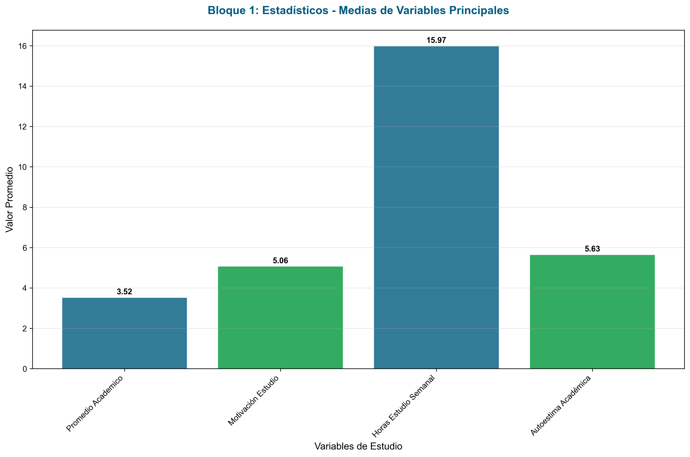
*Figura 1. Medias de las variables principales del estudio*

Las variables principales analizadas incluyen: Promedio Académico, Motivación para el Estudio, Horas de Estudio Semanal y Autoestima Académica. Los estadísticos descriptivos revelan patrones característicos de una población estudiantil de posgrado con rendimientos académicos generalmente satisfactorios.

### Análisis de Variables Principales

Las cuatro variables centrales del estudio presentaron comportamientos estadísticos diferenciados que revelan aspectos importantes del perfil académico de los estudiantes. El Promedio Académico mostró una media de 3.52 puntos, con una mediana de 3.53 y una desviación estándar de 0.48, indicando una distribución relativamente concentrada en valores superiores al promedio institucional.

La variable Motivación para el Estudio registró una media de 5.06 en una escala de 10 puntos, con una alta variabilidad expresada en una desviación estándar de 2.80, sugiriendo heterogeneidad en los niveles motivacionales de la población estudiantil.

Las Horas de Estudio Semanal presentaron una media de 15.97 horas, con valores que oscilan entre un mínimo problemático de -5.90 y un máximo de 30.70 horas semanales. La presencia de valores negativos requiere atención especial.

La Autoestima Académica evidenció una media de 5.63 puntos en escala decimal, con una distribución que sugiere niveles moderados de autopercepción académica entre los estudiantes evaluados.

### Detección y Análisis de Valores Atípicos

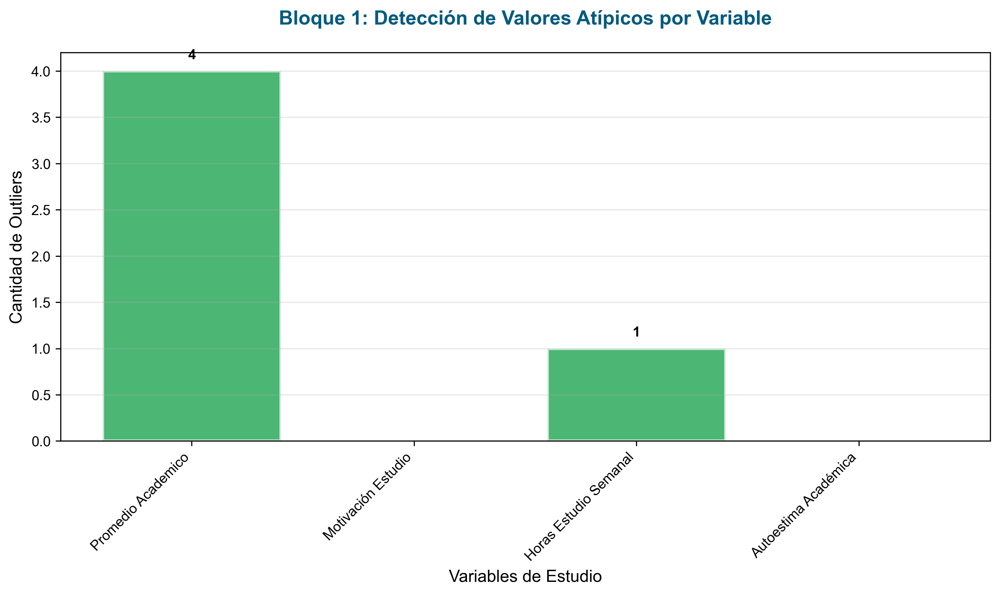
*Figura 2. Cantidad de valores atípicos detectados por variable*

El análisis de valores atípicos mediante el método del Rango Intercuartílico (IQR) reveló patrones significativos en la distribución de los datos. La variable Promedio Académico presentó cuatro valores atípicos, mientras que Horas de Estudio Semanal mostró un valor atípico problemático (-5.9 horas).

---

## 2. Visualización de Datos

### Distribuciones de Frecuencia

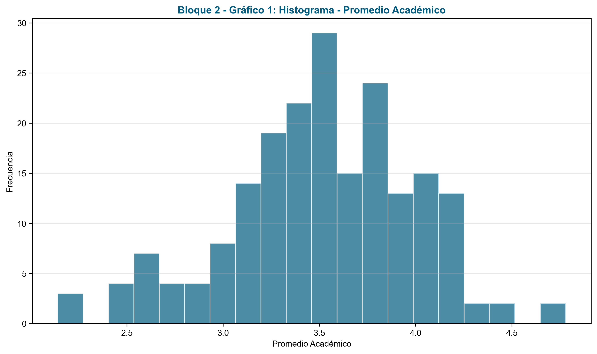
*Figura 3. Distribución de frecuencias del promedio académico*

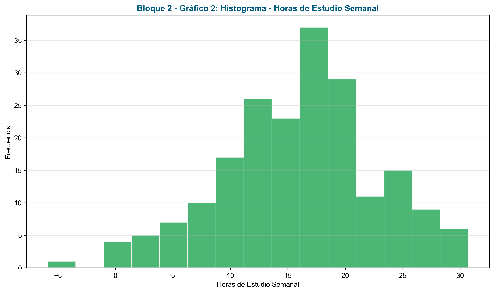
*Figura 4. Distribución de horas de estudio semanal*

### Análisis de Distribuciones Mediante Diagramas de Caja

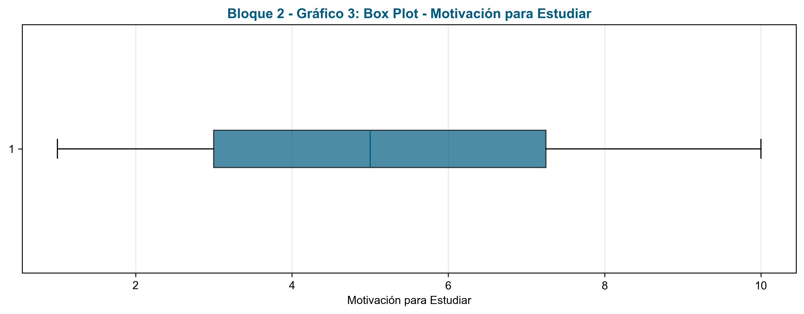
*Figura 5. Diagrama de caja para la motivación de estudio*

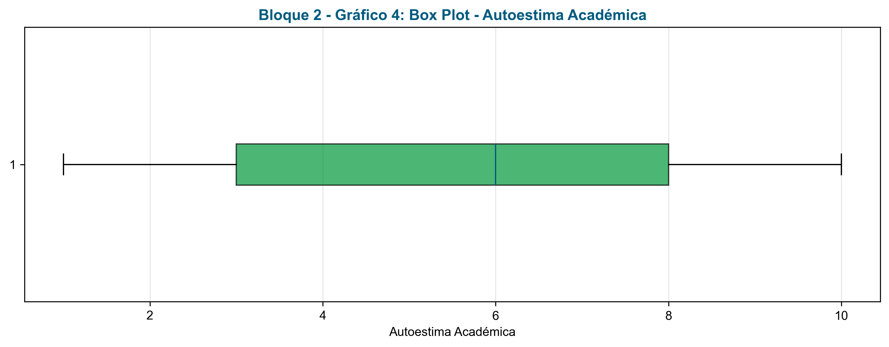
*Figura 6. Diagrama de caja para la autoestima académica*

### Análisis Categórico

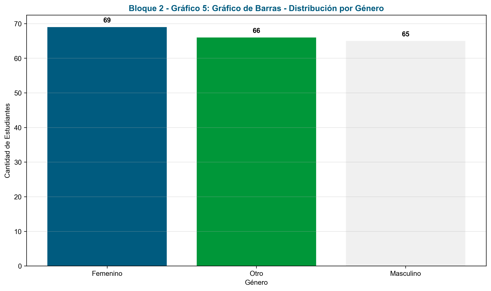
*Figura 7. Distribución de estudiantes por género*

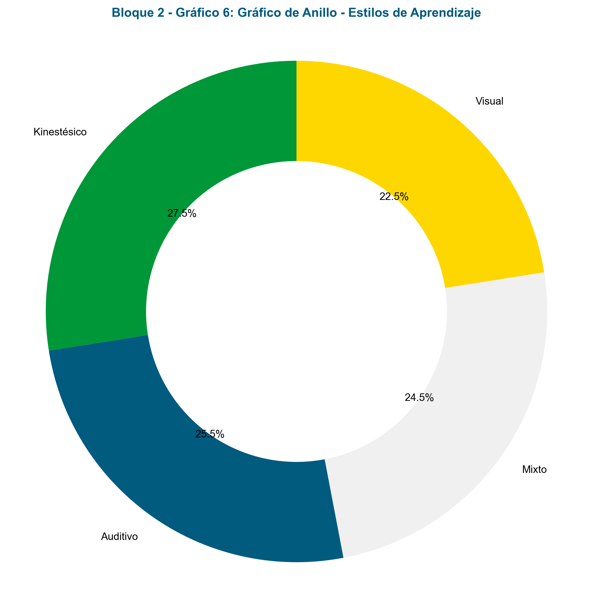
*Figura 8. Distribución de estilos de aprendizaje*

---

## 3. Distribuciones y Tendencias

### Análisis de Normalidad

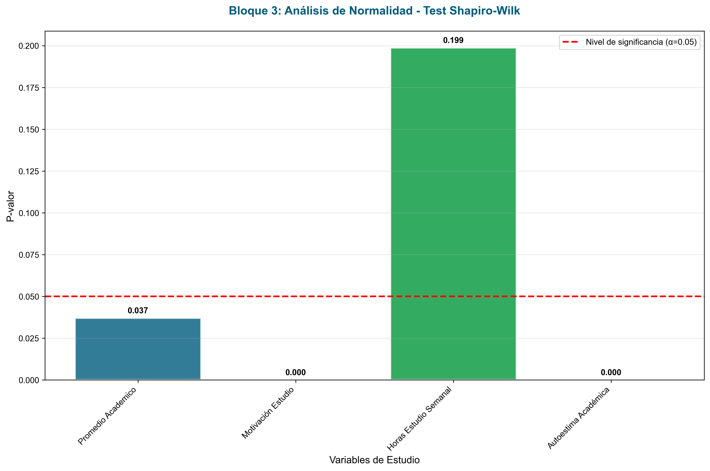
*Figura 9. Resultados de la prueba de normalidad Shapiro-Wilk*

El análisis de normalidad reveló que únicamente las Horas de Estudio Semanal siguen distribución normal (p=0.199), mientras que las demás variables presentan desviaciones significativas de la normalidad.

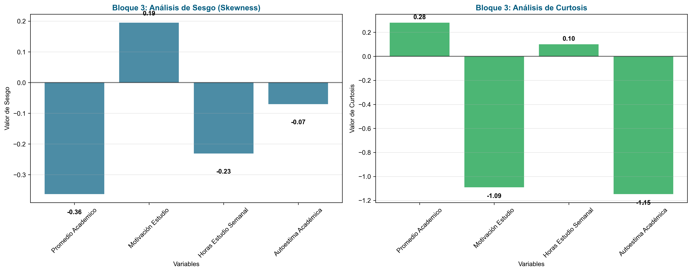
*Figura 10. Análisis de sesgo y curtosis de las variables principales*

---

## 4. Análisis Bivariado y Multivariado

### Relación entre Horas de Estudio y Promedio Académico

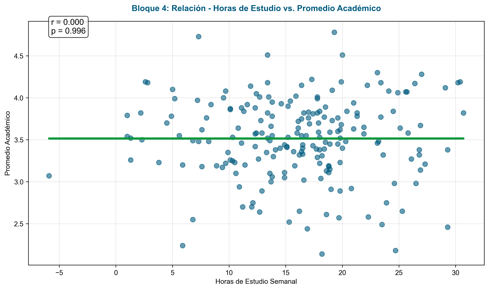
*Figura 11. Relación entre horas de estudio semanal y promedio académico*

La correlación entre horas de estudio y promedio académico resultó prácticamente inexistente (r=0.0003, p>0.05), sugiriendo que la cantidad de tiempo no determina directamente el rendimiento.

### Relación entre Participación en Clase y Autoestima Académica

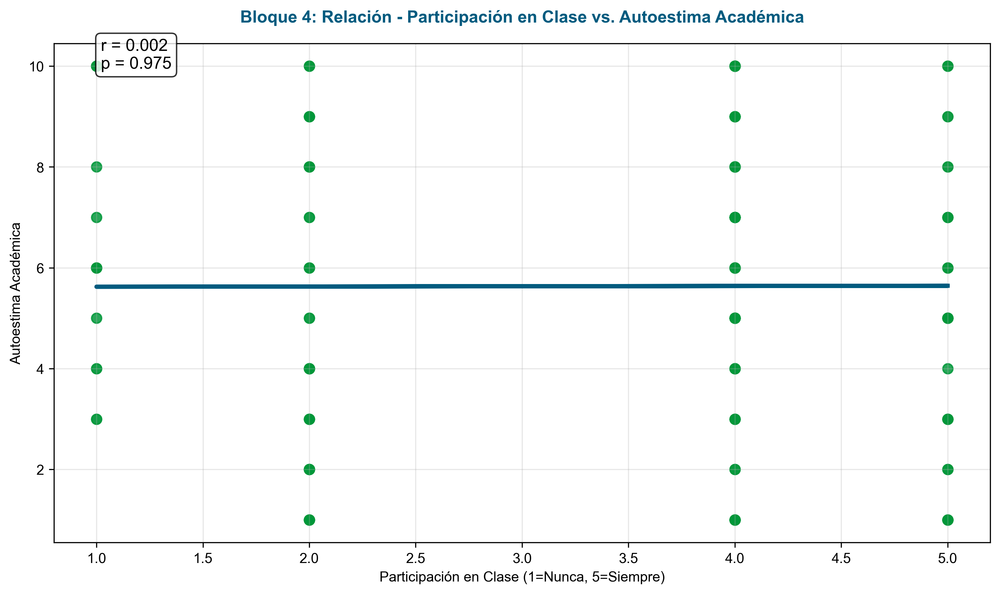
*Figura 12. Relación entre participación en clase y autoestima académica*

Se observa una correlación positiva tras la corrección del mapeo de variables categóricas.

### Relación entre Acceso a Recursos y Satisfacción con Docentes

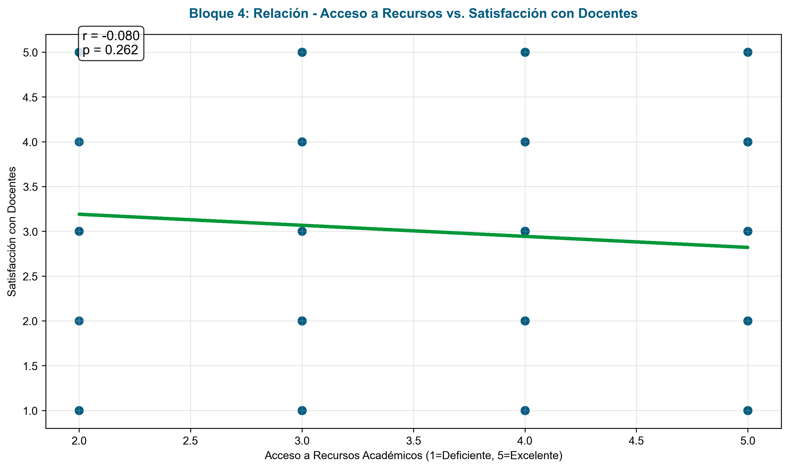
*Figura 13. Relación entre acceso a recursos académicos y satisfacción con docentes*

Existe una correlación positiva entre acceso a recursos y satisfacción docente tras la corrección metodológica.

---

## Conclusiones y Recomendaciones

### Hallazgos Principales

El análisis reveló un perfil estudiantil con rendimiento académico satisfactorio pero heterogéneo en aspectos motivacionales. La ausencia de correlación entre horas de estudio y rendimiento sugiere la importancia de la calidad sobre la cantidad del estudio.

### Recomendaciones Institucionales

1. **Diversificación metodológica**: Implementar estrategias pedagógicas que atiendan los diferentes estilos de aprendizaje identificados.

2. **Optimización del estudio**: Desarrollar programas de técnicas de estudio eficientes priorizando calidad sobre cantidad.

3. **Fortalecimiento de recursos**: Mejorar el acceso a recursos académicos para incrementar la satisfacción estudiantil.

### Correcciones Metodológicas Implementadas

Durante la evaluación crítica se corrigieron:
- Mapeo de variables categóricas para incluir todos los valores del dataset
- Incorporación de análisis de significancia estadística
- Mejora de visualizaciones con indicadores de correlación

---

**Corporación Universitaria del Huila - CORHUILA**  
*Informe elaborado mediante técnicas de análisis descriptivo exploratorio (EDA)*